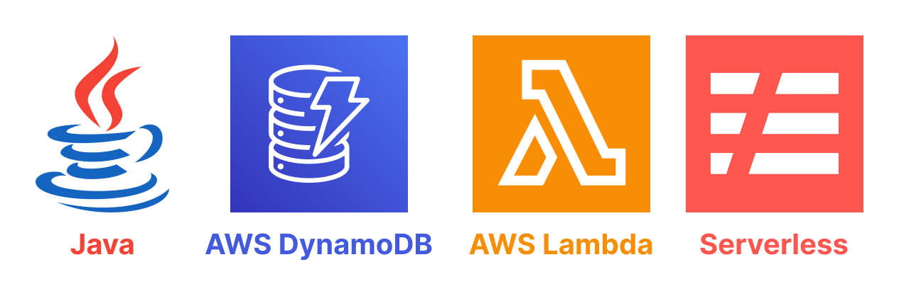

# Java + Serverless + AWS Lambda



This repository demonstrates a basic integration of AWS Lambda Serverless API,
using Java 17 and AWS DynamoDB for data storage.

# 0. Technologies used

| Technology | Version  |
|------------|----------|
| Java       | 17.0.8.1 |
| Serverless | 3.35.2   |

# 1. Usage

1. After any modification, generate a new JAR file:

```shell
./gradlew clean build
```

2. Then deploy the new serverless backend to AWS Lambda:

```shell
serverless deploy
```

Or

```shell
sls deploy
```

3. Test the API

Here is the example API to test all CRUD operations:

| Endpoint                               | Method   | Description                      |
|----------------------------------------|----------|----------------------------------|
| `/api/v1/authors`                      | `POST`   | Create a new author.             |
| `/api/v1/authors?find-all=true`        | `GET`    | Fetch all authors from DynamoDB. |
| `/api/v1/authors?id={authorId:string}` | `GET`    | Fetch a single author by ID.     |
| `/api/v1/authors/{authorId:string}`    | `PUT`    | Update a single author by ID.    |
| `/api/v1/authors/{authorId:string}`    | `DELETE` | Delete a single author by ID.    |

- Make sure to update the `base-url` in collection, which gets generated after Serverless deploys to AWS Lambda.
- **Note:** this API can be imported into Postman from [here](postman/spring-boot-serverless-crud-aws-lambda.postman_collection.json).

## 3.1. Cleanup

Don't forget to destroy everything after testing is finished:

```shell
serverless remove
```
